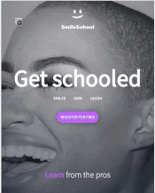
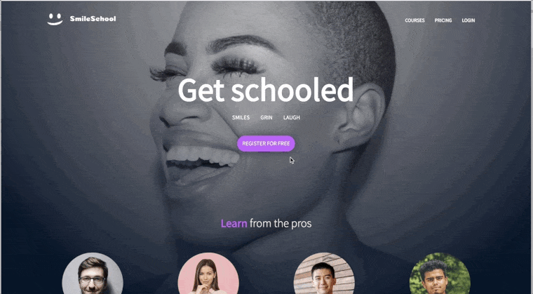
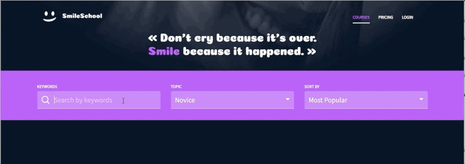
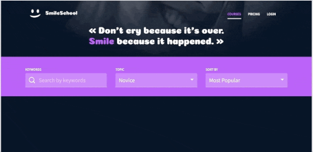
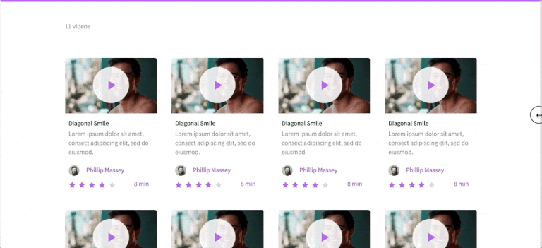

# Implement a design with bootstrap

In this project, you will implement 3 web pages with Bootstrap. You will use all **HTML/CSS/Accessibility/Responsive design/Bootstrap** knowledges that you learned previously.
You won’t have a lot of instruction, you are free to implement it the way that you want - the objective is simple: Have fully functional web pages that look the same as the designer file.
Here the final result:

**Interactions note:**

- Web pages must switch to the tablet version when the screen width is 768px
- Web pages must switch to the mobile version when the screen width is 576px

## Here are some main tasks of this project

### Header first

*Let’s start by the Homepage:  *create the header/hero piece*

### Carousel of quotes

*Create the section *“Carousel of quotes”*

### Create the section “Most popular tutorials”

*By using a Carousel component of Bootstrap, create this Carousel of video cards.*

**Reminder:**

- Desktop: 4 cards
- Tablet: 2 cards
- Mobile: 1 card

### Row of smiles

*Create the section “Free membership”* 

### Prices grid  mandatory

*Create the prices grid*

### Search filters

*Create the search filters section*

Dropdown is a nice way to create filters.

 

### List of result  mandatory

*Create the result section of courses*

### Close the page with a footer

### Author
* Artur Adamian | [GitHub](https://github.com/arturadamian) | [Twitter](https://twitter.com/arturadamian) | [LinkedIn](https://www.linkedin.com/in/arturadamian/)

Hi, I am Artur. I am a Software Engineer Student at Holberton School where I currently study Web Development and polish my knowleges in Low-Level and Object-Oriented programming, as well as developing strong professional communication skills.

